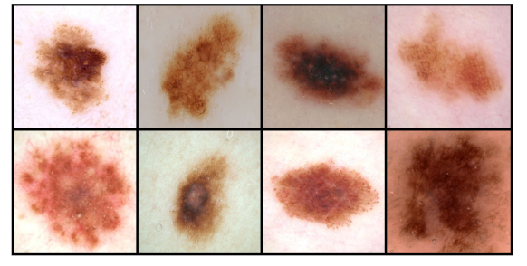
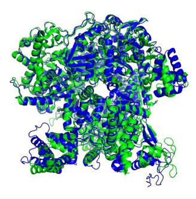
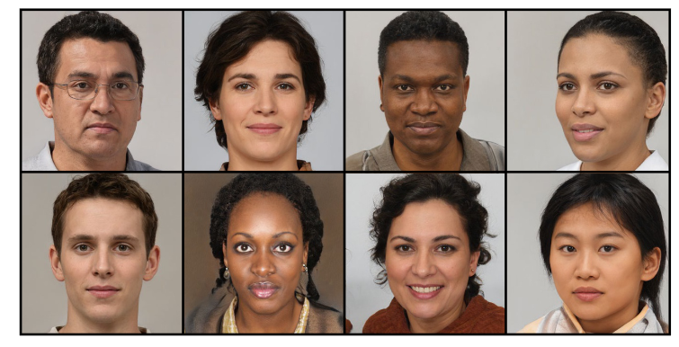

# 1 深度学习革命（The Deep Learning Revolution）

机器学习是当今最重要的，发展速度最快的科技领域。机器学习的应用正变得无处不在，从数据中学习解决方案在一步步取代人工设计的算法。这不仅提高了现有技术的性能，而且已经打开了新世界的大门，这对于人工设计的算法来说是不可想象的。

深度学习作为机器学习的一个特殊的分支，已经成为一个强大且通用的从数据中学习的框架。深度学习基于一种被称为 _神经网络_ 的计算模型，其灵感来自于人脑的学习和信息处理的机制。人工智能一直在寻求重现大脑的强大能力，如今人工智能和机器学习这两个名词经常互换使用。目前使用的很多 AI 系统都代表了一种用于解决某个特定问题的机器学习应用，虽然这非常有用，但远不及人类大脑。这引出了通用人工智能 Artificial General Intelligence（AGI），即建立一种更加灵活的机器。经过多年的研究，机器学习已经进入了快速发展的阶段。最近，被称为大语言模型的大型深度学习系统已经开始表现出不可思议的能力，这被认为是通用人工智能的标志。

## 1.1 深度学习的冲击（The Impact of Deep Learning）

我们通过思考四个不同领域的例子来说明机器学习的巨大适用性并解释一些术语和基本概念。值得注意的是，这些例子和其他许多应用都是使用相同的深度学习框架的变体来实现的。这和传统使用广泛不同和特定技术方法大相径庭，应该说明的是我们所选择的例子只是深度学习广泛应用的一小部分，几乎每一个依赖于计算的领域都可以得益于深度学习的变革性影响。

### 1.1.1  医学诊断（Medical diagnosis）

第一个要介绍的机器学习应用是皮肤癌的诊断问题。黑色素瘤是最危险的皮肤癌种类，但是如果及早发现是可以治愈的。`图 1.1` 展示了皮肤病灶一些实例图，上面一行是黑色素瘤而下面一行是良性痣。分别这两类图片是一个巨大的挑战，想要人工设计一种以合理的准确度来有效地分类的算法几乎是不可能的。

> Figure 1.1：上面一行是和皮肤癌相关的恶性黑色素瘤，下面一行是良性痣。没有经过训练是很难区分两者的。

这个问题已经使用深度学习有效地解决了（Esteva et al.,2017）。通过使用了大量的皮肤病灶图像作为训练集，每一张图都通过活体组织检查被标记为恶行或良性，以确定其真正的类别。这个训练集用于训练一个具有 25 万参数，或者说权重的深度神经网络。通过数据来确定参数的过程被称为 _学习_ 或 _训练_。训练好的模型的目标是仅通过新的皮肤病灶的图片来预测其类别而不需要费时费力的活体组织检查。这是一个典型的 _监督学习_ 问题，因为对于每个训练样本，模型都被告知了正确的类别。这也是一个典型的 _分类_ 问题，因为每个输入都被映射到离散的分类集（在这里是恶性或良性）。如果输出是连续的值则被称为 _回归_ 问题，一个回归问题的例子就是化工生产中的产量预测，输入包括温度、压力和反应物浓度。

这个应用一个有趣的方面是可用的带标记的图片数量大概 129,000 相对来说是比较小的，因此深度神经网络首先在一个拥有 128 万张日常图片（例如狗、建筑和蘑菇）的大型数据集上进行训练，然后在皮肤病灶上进行 _微调_。这是一个 _迁移学习_ 的例子，即首先在日常图片上学习通用的特性，然后针对特定的皮肤病灶问题进行特殊训练。通过使用深度学习，皮肤病灶图像的分类已经达到了皮肤科医生的精确度（Brinker et al.,2019）。

### 1.1.2 蛋白质结构（Protein structure）

蛋白质时常被称作生命的构建基础。它们是包含一条或多条被称为氨基酸链的生物分子，有 21 种不同的类型的氨基酸，而蛋白质是由氨基酸序列确定的。一旦一个蛋白质在细胞内被合成，就会折叠成一个复杂的三维结构，正是这种结构决定了蛋白质的行为和作用。半个世纪以来，通过给定氨基酸序列，计算这种 3D 结构，一直是生物学一个基础的公开问题，指导深度学习出现才取得了相对小的进展。

3D 结构可以通过例如 X 射线、低温电子显微镜或者核磁共振波谱法等方法在实验上进行测量。然而这可能非常耗费时间，并且对某些蛋白质来说可能具有挑战性，例如可以获取纯净的样本或者由于或者其结构依赖于环境。而相反的是测量蛋白质的氨基酸序列则具有较低的成本和较高的效率。因此为了更好的理解生理过程或者研发药物，直接从氨基酸序列来预测蛋白质的 3D 结构的方法一直非常吸引人。如果训练集包含一组已知的蛋白质的氨基酸序列和对应的 3D 结构，那么一个深度学习模型可以使用氨基酸序列作为输入，使用 3D 结构作为输出来训练。蛋白质结构预测就是另一个经典的监督学习。一旦这个系统被训练，就可以接受一个新的氨基酸序列作为输入，预测相应的 3D 结构（Jumper et al.,2021）。图 1.2 比较了预测的蛋白质 3D 结构和 X 射线得到的基本真实结构。

> Figure 1.2：被称为 T1044/6VR4 的蛋白质的 3D 结构。绿色的部分表示了 X 射线得到的基本真实结构，叠加的蓝色结构表示由 AlphaFold 深度学习模型得到的预测。

### 1.1.3 图片合成（Image synthesis）

在上面讨论的两个应用中，神经网络学习如何从输入（皮肤图片或氨基酸序列）转换到输出（病灶分类或 3D 蛋白质结构）。我们现在看另一个例子，训练数据只是由一组图片样本组成，目标是让训练好的模型能够创造出相同风格的新图片。这是一个 _无监督学习_ 的例子，因为这个例子和病灶分类或蛋白质结构的例子正好想法，图片样本没有对应的标签。图 1.3 展示了一个使用在平实背景下拍摄的人类面部图片的数据集训练的神经网络生成的一些图片。这种合成图片有极高的品质并且很难喝真实的人类区分开。

> Figure 1.3：使用无监督学习训练的神经网络生成的面部图像。From https://generated.photos

这是一个 _生成式模型_ 的例子，因为它能够以相同的统计特性生成和训练数据不同的输出示例。这种方法的变体允许基于输入 _提示_ 文本来生成图像，从而使图像内容反映输入文本的含义。_生成式 AI_ 被用于描述那些能够生成图像、视频、音频、图片、候选药物分子或其他事物的深度学习模型。

### 1.1.4 大语言模型（Large language models）

机器学习近期最重要的进展之一就是发展出了一种可以处理自然语言或其他像源代码等序列数据的强大模型。_大语言模型_ 或者说 LLM（Large Language Models），使用深度学习来建立丰富的内部表示从而可以捕获语言的语义属性。一种最重要的大语言模型类别叫做 _自回归_ 语言模型，可以生成语句，因此他们是声称是人工智能的一种形式。这种模型使用单词序列作为输入，而在输出时，生成该单词序列的下个一单词。这个在结尾添加了新单词的增广序列，可以再被输入到模型中来生成后续的单词，这种处理可以被一直重复从而生成一个长的单词序列。这种模型同样也可以生成一个特殊的‘停止’词来结束文本生成，从而允许它生成有限长度的文本后停止。基于这点，用户可以在将完整的单词序列反馈给模型前，加上自己的单词从而触发进一步的文本生成。通过这种方式，人们就可以和神经网络进行对话。

这种模型在大型文本数据集上训练，数据集是随机选取的单词序列和已知的该序列的下一个单词作为输入输出对。这也是一种 _自监督学习_，即学习从输入到输出的映射，但是输出的标签是从输入数据中自动获得的，不需要人类标记。由于可以从很多来源获得大量的文本，这种方法允许扩展到非常大的训练集并且使用非常大的神经网络。

大语言模型可以建立非常强大的能力，被描述为新兴的通用人工智能的早期迹象（Bubeck et al.,2023）。我们将会在本书的最后一节讨论这种模型。在下面我们使用被称作 GPT-4（OpenAI,2023）的模型作为语言生成的例子，使用 'Write a proof of the fact that there are infinitely many primes; do it in the style of a Shakespeare play through a dialogue between two parties arguing over the proof.' 作为输入提示。
> 写出素数有无穷多个这一事实的证明；通过两方就证明进行争论的对话，以莎士比亚戏剧的风格来做到这一点。

|GPT-4: Proof of infinitely many primes|
|-|
FIRST PARTY: Thou dost not understand, my friend, There simply is no upper end To primes, those numbers indivisible, No matter if it seems impossible. 
SECOND PARTY: But how dost thou so surely know? To prove this truth, what canst thou show? 
FIRST PARTY: Consider this, my doubtful peer, A clever proof that will make clear: Assume that there’s a final prime, The largest one we’ll see in time. Let’s call this number "P" for short, And then, my friend, we will purport To build a number "Q" that’s new, One larger than "P" and prime too. 
SECOND PARTY: But how, my friend, will this be done? The proof is not yet fairly won. 
FIRST PARTY: It’s simple, friend, just wait and see, We’ll multiply the primes, that’s key. All primes from two to "P" combined, Will make this new "Q" we will find. But one thing more we must include, To make the proof more watertight, We’ll add a one onto the end, And now the proof is in our sight. 
SECOND PARTY: I see it now, it’s crystal clear, For "Q" must be a prime, my dear. It can’t divide by any prime, All smaller than itself in time. And since we chose "P" as the last, This proves that our assumption’s past. There is no final prime, we see, The numbers go on endlessly.

